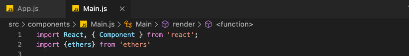
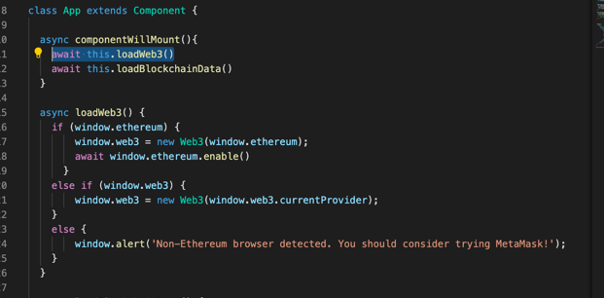
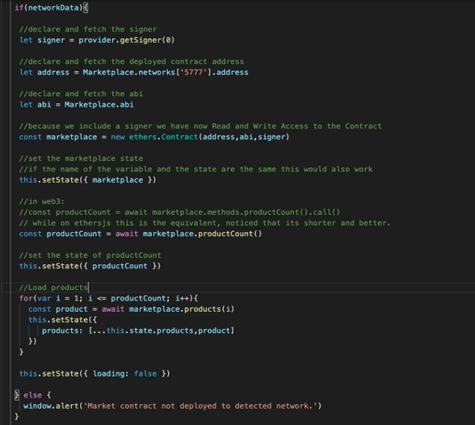
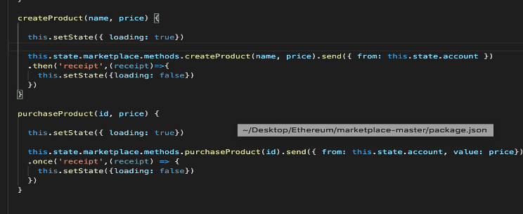
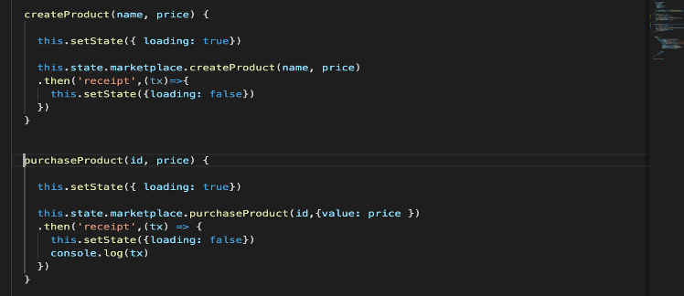
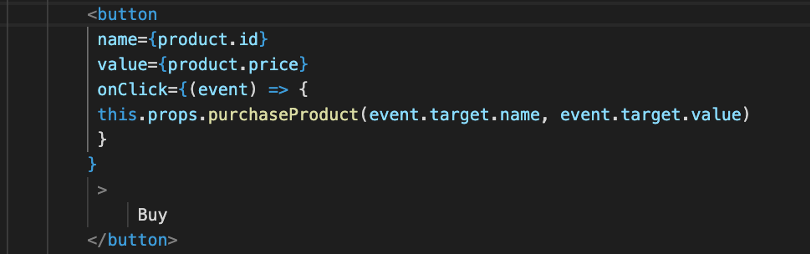
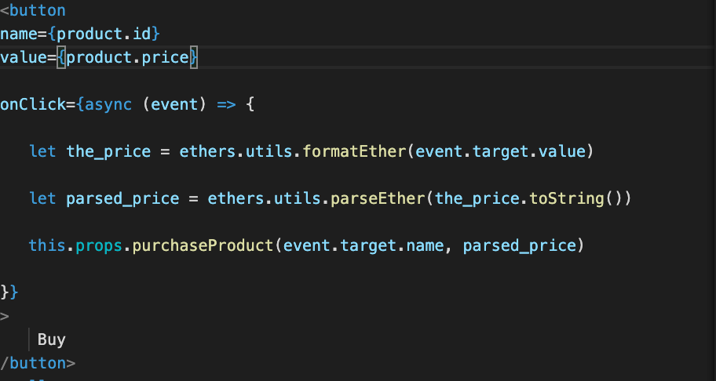

# marketplace_ethersjs
This is a project From Dapp University that I converted from web3 to ethersjs.

1. Go to project directory and type this command to install ethersjs:
  `npm install ethers`
  
2. import the ethersjs in both the App.js and Main.js files
   

3. remove the `loadWeb3()` function because we will create the connection and access blockchain data to   read and write inside loadBlockchainData() function:
    
   

4. at this step in App.js file we will work on converting the code to ethersjs inside the `loadBlockchain()` function:

    •	enter this code to make a connection to metamask:

      `let provider = new ethers.providers.Web3Provider(web3.currentProvider);`

    •	load the account using provider and set the state of the account:

       `const accounts = await provider.listAccounts();`
       `this.setState({ account: accounts[0] });`

    •	fetch the network id inside from the compiled Marketplace(abi), `5777` is the network id for ethereum test network in ganache:

      `const networkData = Marketplace.networks[‘5777’];`

    •	put a condition if network is detected or not:

      if(networkData)
        {
        }else
       {
      Window.alert(‘Market contract note deployed to detected network’);
        }

    •	inside the if(networkData) put these code inside:
    
      

5.	inside the `createProduct(`) and `purchaseProduct()` function change this code:

      

      To This Code:
      
      

6. In Main.js find the code and convert it into the following:
      
    From:
    const price = window.web3.utils.toWei(this.productPrice.value.toString(),'Ether')
    
    To:
    const price = ethers.utils.parseEther(this.productPrice.value).toString(10);

    From:
    <td>{window.web3.utils.fromWei(product.price.toString(),'Ether')} Eth</td>
    
    To:
    <td>{ethers.utils.formatEther(String(product.price))} Eth</td>

    From:
    
    

    To:
    
    

6.	It’s done!  Now try running it up again:
    `truffle migrate --reset`
    `npm start`

Note: everytime the transaction is mined refresh your browser to see the changes
